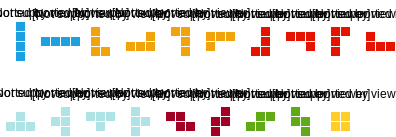

# Fillit

Fillit is not about recoding Tetris, even if it’s still a variant of this game. The program will take a file as parameter, which contains a list of Tetriminos, and arrange them in order to create the smallest square possible.
Obviously, the main goal is to find the smallest square in the minimal amount of time, despite an exponentially growing number of possibilities each time a piece is added.

