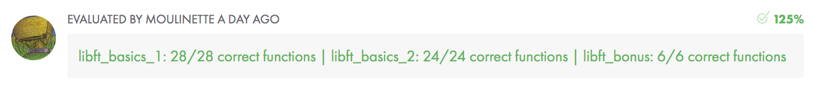

# libft

The aim of this project is to code a library of useful functions that will be allowed to reuse in most of C projects at 42.

[Subject](./libft.en.pdf)

I build this project on the [DRY](https://en.wikipedia.org/wiki/Don't_repeat_yourself) ideas.

